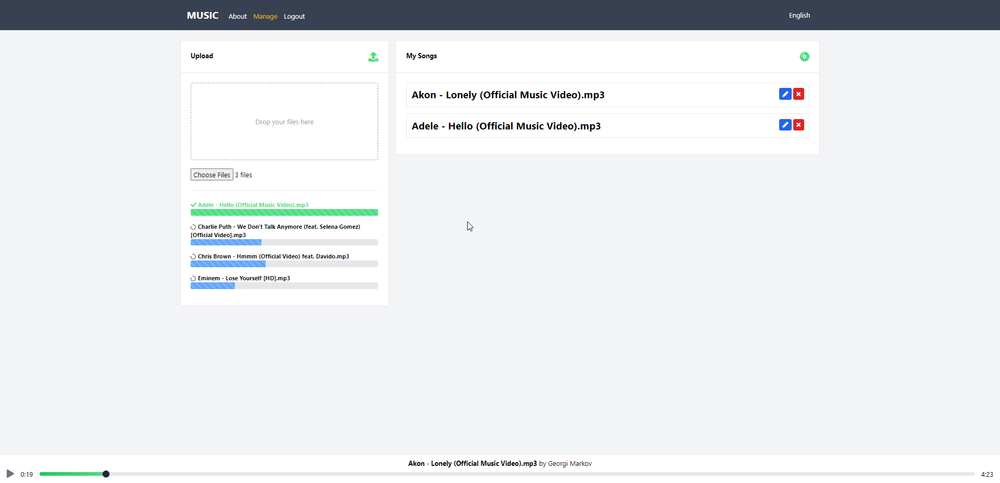

Mp3-Player-Vue-Project-001

# Mp3-Player

## Introduction

Mp3-Player is application for uploading and listening to songs.

## Features

- Firebase Authentication,Database,Storage
- i18n for Internationalization
- Vitest for testing
- Tailwind CSS

## How to use?

- 0.Download the repository and extract it to folder
- 1.Open the folder with Visual Studio Code
- 2.npm install
- 3.npm run dev
- 4.Open the browser and go to http://localhost:5173
- 5.Enjoy!

## Photos

### Uploaded Songs

### Songs Progress Bar

### Home - All Songs

### Comments

### Edit Song Name and Genre

### Firebase Authentication

### Firebase Storage

### Firebase Cloud Firestore

## Swagger Endpoints

## Home page with Search and Dashboard

